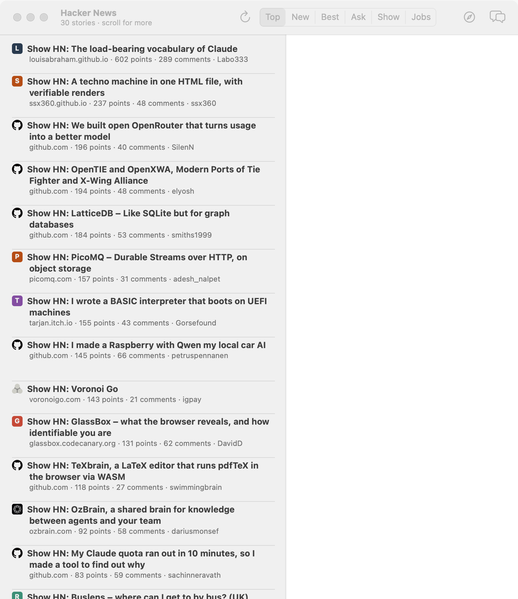
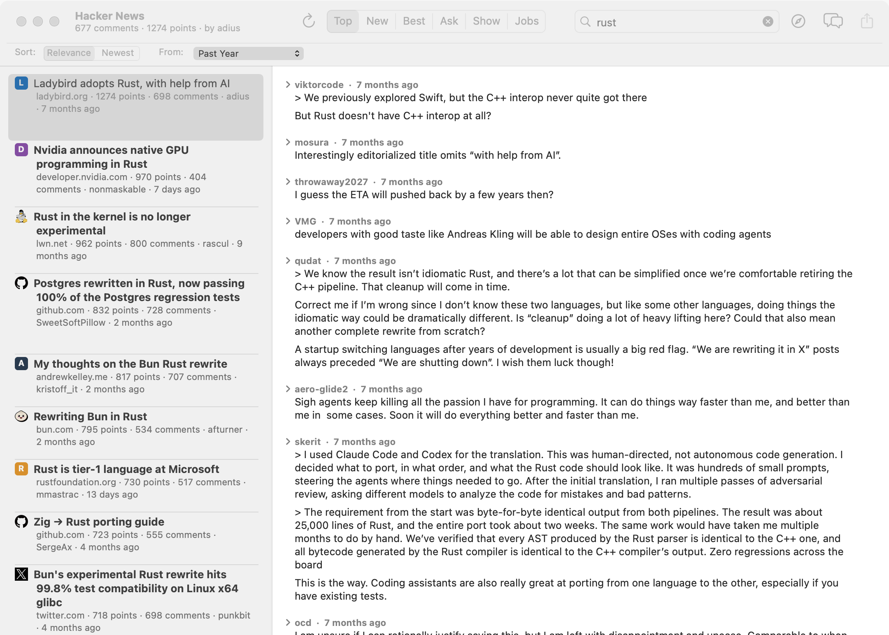
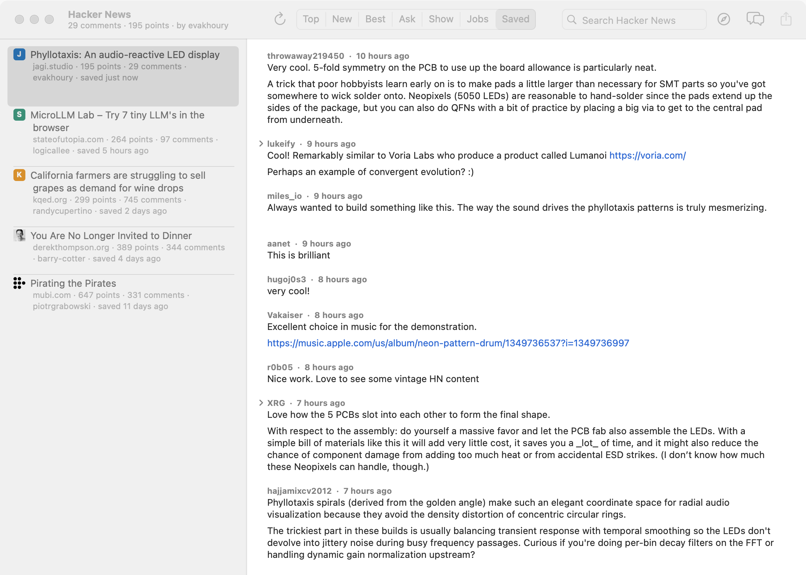
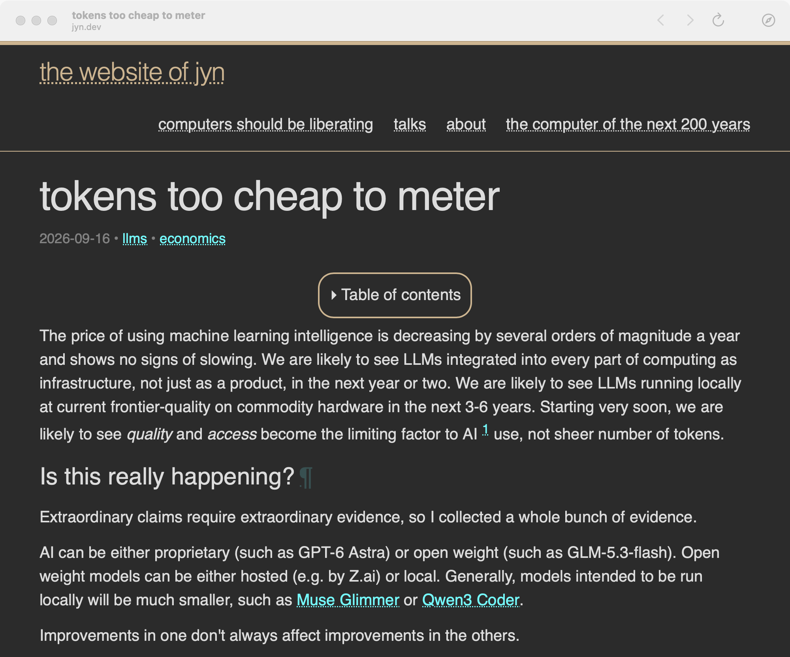
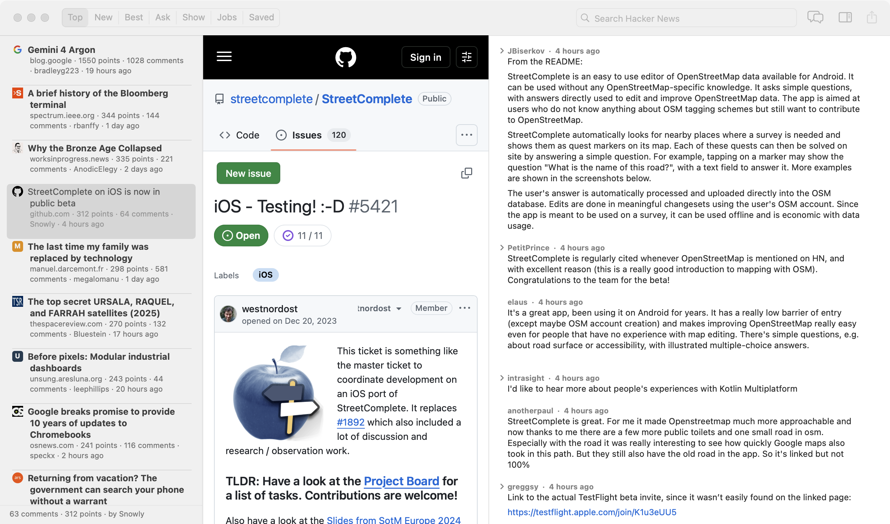
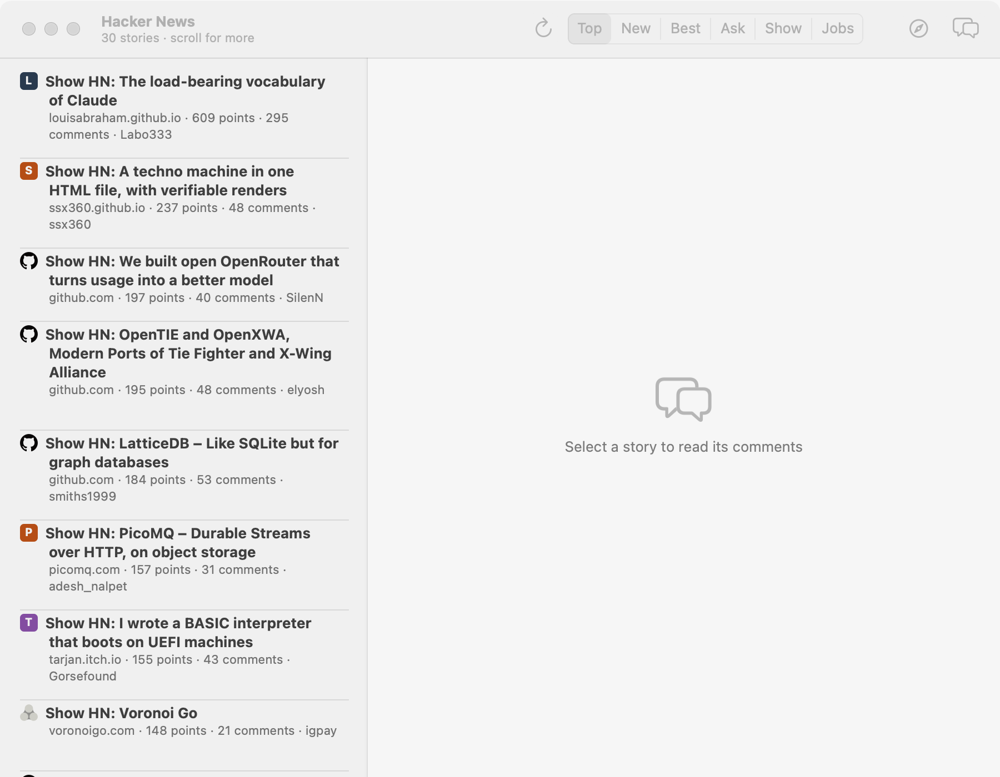
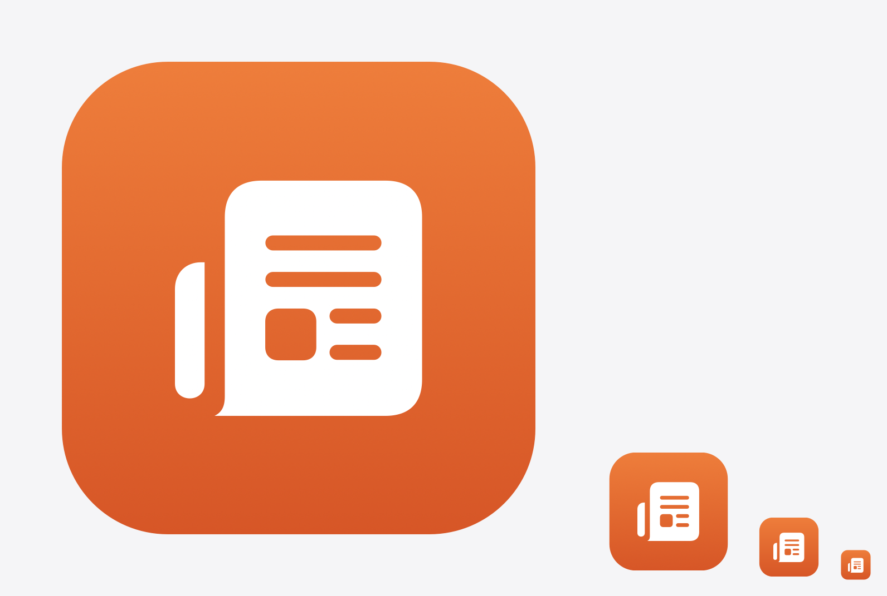

# Hacker News

A Hacker News reader for macOS, written in Ruby.



Not Ruby generating a user interface, and not a web view wearing a title bar:
real AppKit. An `NSSplitViewController` with a sidebar, a unified toolbar with
SF Symbols, view-based tables, a `WKWebView`, the system share sheet — all of
it driven from Ruby, through a bridge written for the purpose.

That bridge lives in [`cocoa/`](cocoa/) and is a subproject of its own. It is
what makes this repository an answer to the question
[MacRuby](https://github.com/macruby/macruby) used to answer before it stopped
working: can a Mac application be written in Ruby? This one is, on stock
CRuby, with no patched interpreter.

## Running it

```bash
rake run     # compile the bridge, then start the reader
rake app     # build build/Hacker News.app, with a Dock icon and a name
```

macOS 12 or later, and any Ruby with a working compiler. `rake run` builds the
native extension first if it has to.

## What it does

**Reading.** Stories on the left, the full comment thread on the right. Every
row is a real `NSTextField` rather than a drawn cell, so comment text is
selectable and its links are clickable:

```ruby
field.setSelectable(true)
field.setAllowsEditingTextAttributes(true)
```

Those two lines are what make `NSLinkAttributeName` live. Link positions
survive HTML conversion as ranges measured in UTF-16 code units — the unit
`NSAttributedString` counts in, which matters the moment a comment contains an
emoji. Comments open collapsed, and ⇧⌘] and ⇧⌘[ open and close the lot.

**Sections.** A segmented control switches between Hacker News's own — Top,
New, Best, Ask, Show and Jobs — each with a ⌘-number. They are described as
queries in one table rather than scattered through the API client. Ranking Ask
and Show across all time surfaces 2010's classics, so both are windowed to the
past week; jobs are time-sensitive and rarely upvoted, so that one is
newest-first.

**Search.** ⌘F, and the results narrow whichever section is showing — "Show
HN" plus "raspberry pi" is a sensible question, so it is one you can ask. A
filter bar appears under the toolbar while a search is running, as a titlebar
accessory, the way Safari's find bar does:



Ranking by date is asked for precisely — `typoTolerance=false`, and titles and
URLs only — because nothing downstream will sort a bad match down. Algolia
allows one typo in a four-letter word, so a search for "rust" otherwise comes
back full of "trust" and "restart". Ranking by relevance keeps both, which is
what still finds Kubernetes when you type "kubernets".

**Saving.** ⌘D keeps the story you are reading, and a **Saved** section sits
beside Hacker News's own, on ⌘7. It is answered from disk rather than from
the API — nothing is requested, there is no second page, and the search field
filters what is already in hand. A star marks saved stories everywhere else;
in Saved itself every row carries one, so instead each says when it was
saved.



What is kept is the whole story, not its identifier. The API will not
necessarily still answer for a story months later, and an export has to stand
on its own.

**Exporting.** File → Export Saved Articles writes the lot in any of four
formats:

| | |
|---|---|
| **Markdown** | A readable list — title, link, meta, discussion — to paste into a notebook |
| **JSON** | Every field kept, for another tool to read |
| **OPML** | An outline of links, which is what OPML is for once you look past feeds |
| **Browser bookmarks** | The Netscape format Safari, Chrome and Firefox all import |

The formatters are plain Ruby: stories in, a String out. No panels, no file
system, so each format is checked without any of that, down to the escaping
of a title with `&`, `<` and `"` in it.

**Paging.** The list pages as you scroll. The front page is exactly thirty
stories, so anything past it continues with the last week's stories ranked by
points — roughly what Hacker News's own "More" link amounts to. Consecutive
pages overlap, so identifiers already shown are dropped, and a page that turns
out to be entirely duplicates is skipped rather than stalling the list.

Prefetching is triggered from `tableView:viewForTableColumn:row:`, which is
asked only for rows actually on screen. Row heights are asked for *every* row,
so triggering there would fetch the whole archive the moment the table
reloaded. The load is then deferred to the next turn of the run loop, because
changing a table's row count while it is updating its visible rows throws.

**Refreshing.** The list refetches itself on a timer, but only when the reader
has not been disturbed: a refresh is skipped if a page has already been loaded
beyond the first, or the list has been scrolled away from the top, because
reloading would discard those pages and jump back. The story being read is
reselected afterwards.

**Links.** Double-clicking a story opens it in a built-in reader — a
`WKWebView` with its own history and a `WKNavigationDelegate` implemented as
Ruby blocks — or in the default browser, whichever the preference says. ⌥⌘O
always leaves the app regardless.



**The linked page, in a third column.** ⌃⌘3, and the window becomes stories,
the page they link to, and the comments — left to right in the order you read
them. The page loads as the selection changes, after a pause long enough that
moving down the list with the arrow keys does not ask every site in turn for
something nobody waited to see. A story that is its own discussion says so
rather than loading the thread twice.



Three columns need room for three. When the window has not got it the article
gives way and the stories and their comments keep the space — the window is
never stopped from shrinking — and widening it past the threshold brings the
column back, unless you put it away yourself. Nothing is asked of any site
while the column is off screen, however it came to be off screen.

It is off by default. Be aware of what it changes: selecting a story becomes a
request to that site, where before you chose to open one.

**Sharing.** The toolbar carries an `NSSharingServicePickerToolbarItem`, which
draws the standard control and runs the picker itself, asking the app only for
what to share. A story with no article of its own shares its discussion page
instead. ⇧⌘C copies the link.

**Right-clicking** a story acts on the row under the pointer rather than the
selected one — `clickedRow`, not `selectedRow`. It copies either link
separately, the article or the Hacker News thread, and toggles the story's
read mark, wording itself for whichever way that will go.

**Site icons** lead each row, fetched straight from the domain rather than
through one of the favicon services, so no third party is handed the list of
what is being read. They are cached on disk, and a site without one gets a
coloured monogram so a row never waits on the network to look finished.
Turning them off in Settings brings back the rank column.

**Empty states** say what they are waiting for rather than sitting blank:
which story to pick, that a story has no comments yet, that a search found
nothing, or why something failed to load. The list is hidden while one shows,
so the two can never both be on screen.



**Settings** (⌘,) covers comment expansion, text size, which feed continues
past the front page, how many stories load at a time, where links open, site
icons, whether reading history is kept at all, and clearing the saved list. Preferences are
*registered* rather than written, so a fresh install gets sensible values
without anything being persisted until something is actually changed. Turning
history off forgets what is on disk but keeps the marks made in the current
session, so the list does not visibly reset under the reader.

## The window chrome

The title bar carries controls and nothing else. In a unified toolbar the
title is not above the controls but beside them, competing for the same row,
and it was the widest thing in it — the app name and its status line together
cost about 300pt against 333pt for all seven sections. The app name is in the
menu bar and under the Dock icon already; the window is still titled, for the
Window menu and Mission Control, just not drawn.

The status line moved under the story list, where Finder, Mail and Xcode keep
theirs. It reads in full at the 720pt minimum window, which it did not when it
shared a row with the toolbar — a search would truncate it to
"30 results for “rust” · scroll f…".

Three buttons went with it. Reload is ⌘R and a File menu entry, and the list
refetches on a timer; Open Link is a double-click, ⌘O and a right-click item;
the progress spinner said what the status line says. What is left is the
section switcher, the search field, Discussion and Share — and the toolbar is
customisable, so that is a starting arrangement rather than a decision made
for you.

## Networking

Requests go through `NSURLSession`, and the session is deliberately created
with `NSOperationQueue.mainQueue` as its delegate queue:

```ruby
@session = Cocoa::NSURLSession.sessionWithConfiguration_delegate_delegateQueue(
  configuration, nil, Cocoa::NSOperationQueue.mainQueue
)
```

That one argument is the whole threading story. NSURLSession would otherwise
deliver completion handlers on its own background threads, and those threads
hold no Ruby state: calling a Ruby block from one would be calling into an
interpreter that is not expecting it. Pinning delivery to the main thread
keeps every callback on the thread that already holds Ruby's lock while the
event loop runs.

Stories and comments come from the Algolia Hacker News API. A comment tree
arrives whole, in one response, which keeps a thread to a single request.

## How it is laid out

```
bin/hackernews        starts the reader
lib/hackernews.rb     requires everything below it
lib/hackernews/       the application
test/                 its tests, by subject
tools/build_app.rb    wraps it in a .app bundle
docs/                 screenshots
cocoa/                the bridge it is built on, self-contained
```

Nothing in the suite touches the preferences the reader is actually using.
`Settings`, `ReadingHistory` and `Favorites` each read and write a store they
are given, and the tests give them one of their own — checked by hashing the
real defaults domain before and after a full run. It matters because the two
share a machine: a screenshot script once left the reader launching into the
wrong section.

The models carry no AppKit at all. `StoryList`, `CommentThread`, `Query`,
`Section`, `ReadingHistory`, `Favorites` and `Export` are plain Ruby, tested
with no window, no run loop and no network. The views own their tables and their own Objective-C
delegate class — looked up per instance, because Objective-C registers classes
globally by name and a class defined per instance would have its methods
replaced by the next one, and then answer for the wrong owner.

## The .app bundle

`rake app` wraps the reader in a real bundle, which is what gives it a Dock
icon and a name of its own. The bundle's executable is a launcher that execs
Ruby, which leaves `NSBundle.mainBundle` pointing at Ruby's own directory —
but LaunchServices still identifies the process by the bundle it was launched
from, and that is what the Dock reads. The launcher exports the bundle path so
the app can find its own resources regardless.

The icon is drawn rather than shipped as a file: a gradient plate, rounded the
way macOS rounds app icons, with an SF Symbol knocked out in white. That keeps
the whole thing a directory of Ruby, and it is what the Dock and the About
panel show.



The bundle carries its own copy of both the application and the bridge, on one
load path, so moving the checkout does not break it. It does hardcode the Ruby
that built it, so it is not portable to another machine.

## Tests

```bash
rake test          # everything
rake app_test      # the reader
rake bridge_test   # the bridge
```

483 tests, 1,914 assertions, on Ruby 3.3 (`x86_64` under Rosetta) and on
macOS's own Ruby 2.6 (native `arm64e`) alike — and on five different random
orderings, because a suite that only passes in one order is not passing.

The reader's tests are eight files by subject, each of which runs on its own.
They were one file of 3,779 lines until it had twice hidden a mistake that a
smaller file would have shown: a class name silently reopening another, and an
order dependency between two tests that only appeared when a layout constraint
changed. The API is stubbed, so they are fast and
deterministic; `HN_LIVE=1` additionally runs the real asynchronous path.

The two suites run as separate processes, because each drives the one shared
`NSApplication` — and the bridge's class browser example installs a main menu
of its own.

## Licence

MIT.
