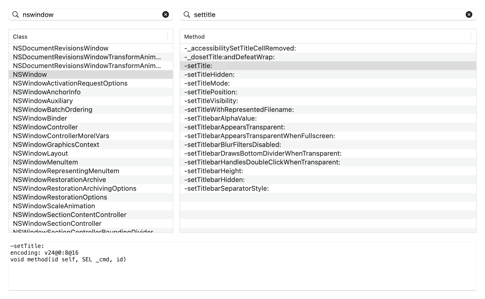

# cocoa-rb

Ruby bindings for Apple's Objective-C frameworks, built on stock CRuby.

This is the bridge the [Hacker News reader](../README.md) at the root of this
repository is built on. It is self-contained -- its own library, extension,
tests and examples -- and has no knowledge of that application.

This is a working prototype of "path 1" from an assessment of whether
[MacRuby](https://github.com/macruby/macruby) could be revived. MacRuby cannot:
it depended on Apple's Objective-C garbage collector (`libauto`), which no
longer exists on disk or in the dyld shared cache, and on the LLVM 2.9 JIT API,
roughly sixteen major versions behind current LLVM. Its own `NO_LIBAUTO`
fallback was defined by the build system but never implemented in a single line
of source.

The insight this project is built on: the two dependencies that killed MacRuby
were both about *being a Ruby implementation*, not about *talking to Cocoa*.
The metadata that makes bridging possible is still shipped and still maintained
by Apple — 216 frameworks carry `.bridgesupport` files, with `arm64e` variants.

So instead of reviving an interpreter, this bridges to one.

```ruby
require 'cocoa'        # ruby -Icocoa/lib
Cocoa.framework 'AppKit'

app = Cocoa::NSApplication.sharedApplication
app.setActivationPolicy(Cocoa::NSApplicationActivationPolicyRegular)

window = Cocoa::NSWindow.alloc.initWithContentRect_styleMask_backing_defer(
  [0, 0, 560, 320],
  Cocoa::NSWindowStyleMaskTitled | Cocoa::NSWindowStyleMaskClosable,
  Cocoa::NSBackingStoreBuffered, false
)
window.setTitle('Ruby loves Cocoa')
window.makeKeyAndOrderFront(nil)
app.run
```

## Status

Everything below is covered by the test suite, which passes on both
architectures -- `rake bridge_test` for the bridge alone, `rake test` for that
and the reader together.

| | |
|---|---|
| Message sending | any selector, via `libffi` over `objc_msgSend` |
| Automatic conversion | Ruby `String`/`Integer`/`Float`/`true`/`false`/`Array`/`Hash` ↔ Foundation |
| Structs by value | `NSRect`, `NSPoint`, `NSRange` in both directions, with named fields from Apple's metadata |
| Constants and enums | resolved from Apple's shipped `.bridgesupport` metadata |
| String constants | resolved through `dlsym` |
| C functions | callable using BridgeSupport signatures |
| Ruby-implemented methods | real `IMP`s backed by `libffi` closures, so delegates and target/action work |
| Blocks | Ruby block ↔ Objective-C block, in both directions, with signatures resolved from Apple's metadata |
| Out-parameters | `read_bool` / `write_bool` and friends on pointers, so a `BOOL *stop` works |
| Exceptions | Cocoa exceptions become rescuable Ruby exceptions; Ruby exceptions survive a round trip through Objective-C |
| Protocols | `NSTableViewDataSource`, `NSOutlineViewDataSource` and friends implemented in Ruby |
| Async networking | `NSURLSession` with completion handlers delivered on the main thread |
| Modern AppKit | `NSSplitViewController` sidebars, unified toolbars, SF Symbols, view-based tables |
| WebKit | `WKWebView` with a `WKNavigationDelegate` written in Ruby |
| Memory | one strong reference per wrapper, honouring the `alloc`/`new`/`copy` ownership rule |

Verified on macOS 15.7 (Sequoia), Apple Silicon, with identical results on
both — 88 tests for the bridge, 395 including the reader:

- Ruby 3.3.0, `x86_64` under Rosetta
- Ruby 2.6.10, native `arm64e`

## Getting started

```bash
rake compile
rake bridge_test
ruby cocoa/examples/hello_window.rb            # opens a real window
ruby cocoa/examples/class_browser.rb           # a real application
ruby cocoa/examples/render_to_png.rb out.png   # renders the UI to a file
```

## The class browser

`cocoa/examples/class_browser.rb` is a working Mac application that browses the
Objective-C runtime it is itself running on: roughly 10,500 classes, filterable,
with each class's methods and their decoded type signatures.



It is the example worth reading, because it needs the things a real app needs
rather than the things that are easy to demonstrate. The table views are driven
by an `NSTableViewDataSource` written in Ruby:

```ruby
Cocoa.define_class('CBTableSource', 'NSObject',
                   protocols: %w[NSTableViewDataSource NSTableViewDelegate]) do |c|
  c.define('numberOfRowsInTableView:', 'q@:@') do |_self, table|
    browser.row_count(table)
  end

  c.define('tableView:objectValueForTableColumn:row:', '@@:@@q') do |_self, table, _col, row|
    browser.value_at(table, row)
  end

  c.define('tableViewSelectionDidChange:', 'v@:@') do |_self, notification|
    browser.selection_changed(notification.object)
  end
end
```

AppKit calls those blocks tens of thousands of times while scrolling. The
browser is covered by `cocoa/test/test_class_browser.rb`, which drives it without an
event loop.

## Blocks

Cocoa's modern APIs are block-based, and a Ruby block can be handed straight to
them. Apple records the signature of every callback argument in the same
`.bridgesupport` files, so nothing needs declaring:

```ruby
words = Cocoa::NSArray.arrayWithArray(%w[alpha beta gamma])

words.enumerateObjectsUsingBlock do |word, index, stop|
  puts "#{index}: #{word}"
  stop.write_bool(true) if index == 1      # a real BOOL * out-parameter
end

words.sortedArrayUsingComparator { |a, b| a.to_s.length <=> b.to_s.length }

Cocoa::NSTimer.scheduledTimerWithTimeInterval_repeats_block(1.0, true) do |timer|
  puts 'tick'
end
```

Signatures are looked up per class, walking the receiver's superclass chain.
This matters more than it sounds: `enumerateObjectsUsingBlock:` takes
`(obj, index, stop)` on `NSArray` but `(obj, stop)` on `NSSet`, and the
receiver is usually a private subclass like `__NSArrayI`.

Where metadata does not exist — a private framework, a C function taking a
callback — declare the signature yourself:

```ruby
adder = Cocoa.block('q', %w[q q]) { |a, b| a + b }
adder.call(19, 23)   # => 42
```

Blocks arriving *from* Objective-C need no metadata at all: the compiler stores
a signature inside the block itself, which `ObjC::Block#call` reads directly.
A block reaching Ruby through a plain `@` return — out of an `NSArray`, say —
is still recognised as one, since every block flavour is a direct subclass of
`NSBlock`.

Blocks are heap blocks that the runtime reference counts like any other object,
so their lifetime is correct in the case that matters: Cocoa retaining a
completion handler keeps it alive after Ruby has forgotten it, and the last
release runs a dispose helper. Because dispose can run on any thread, it only
sets a flag; the closure and descriptor are freed by a sweep on the next Ruby
call. `ObjC.reap_blocks` runs that sweep on demand and reports what is live.

Target/action predates blocks and still needs an object to message, so there is
a helper that mints one:

```ruby
Cocoa.on_action(button) { |sender| puts 'clicked' }
```

## Structs

Structs cross the bridge as flat arrays, and where Apple's metadata names their
fields they arrive as an `Array` subclass with accessors:

```ruby
rect = view.frame        # => #<Cocoa::CGRect x=0.0 y=0.0 width=480.0 height=320.0>
rect.width               # => 480.0
rect.size.height         # => 320.0
rect.origin.x            # => 0.0

rect[2]                  # => 480.0     still an array
rect == [0, 0, 480, 320] # => true
```

Any accepted form works as an argument, including a struct read back out:

```ruby
Cocoa::NSValue.valueWithRect([0, 0, 480, 320])
Cocoa::NSValue.valueWithRect([[0, 0], [480, 320]])
Cocoa::NSValue.valueWithRect(view.frame)
```

Classes are built from the `<struct>` definitions in BridgeSupport, keyed by
the tag that appears inside type encodings rather than the name the file
advertises — Apple calls the struct `NSRange` while its encoding says
`_NSRange`. Nested types are declared by reference (`{CGRect="origin"{CGPoint}
"size"{CGSize}}`) and resolved against the same registry, which is why
`rect.origin` is itself a `CGPoint`. A struct with no metadata degrades to a
plain array rather than failing.

## Exceptions

Exceptions cross the bridge in both directions and behave like ordinary Ruby
exceptions at the call site.

A Cocoa exception arrives as `ObjC::Exception`, carrying the name, the reason,
and the `NSException` itself:

```ruby
begin
  Cocoa::NSArray.arrayWithArray(['a']).objectAtIndex(5)
rescue ObjC::Exception => e
  e.name             # => "NSRangeException"
  e.reason           # => "*** -[__NSSingleObjectArrayI objectAtIndex:]: index 5 beyond bounds [0 .. 0]"
  e.objc_exception   # => the NSException object
end
```

A Ruby exception raised inside a block or a Ruby-implemented method survives
the round trip through Objective-C with its class and message intact:

```ruby
begin
  array.enumerateObjectsUsingBlock { |obj, i, stop| raise ArgumentError, "bad #{i}" }
rescue ArgumentError => e
  e.message   # => "bad 0"
end
```

It cannot simply propagate, because Ruby unwinds with `longjmp` and that would
skip Objective-C's own cleanup. So a callback that raises is trapped with
`rb_protect`, parked, and re-raised the moment control returns to Ruby. While
an exception is parked, further callbacks return immediately without running
any Ruby, so an enumeration that raises on its first element does not run its
body for the remaining ones.

One case has nowhere to propagate to: a handler fired from the run loop, where
no Ruby call is in progress to raise out of. `Cocoa.on_action` therefore
reports those to stderr with a backtrace and keeps the app alive.

## Design

Five layers, about 1,700 lines of C and 700 of Ruby.

**`ext/objc/encoding.c`** turns Objective-C type encodings into `libffi` type
descriptions. Encodings arrive from two sources in the same format:
`method_getTypeEncoding()` for anything the runtime already knows, and Apple's
`.bridgesupport` XML for the things it doesn't (enums, `#define`s, plain C
functions, struct layouts). Aggregates and whole signatures are memoized, so
each distinct encoding is parsed once per process.

**`ext/objc/invoke.c`** marshals values and makes the call. The awkward part is
struct returns: on `x86_64` a struct larger than 16 bytes comes back through
`objc_msgSend_stret`, while `arm64` has no `_stret` variant at all and uses the
indirect result register, which `libffi` handles transparently. `NSRect` is 32
bytes, so this path runs constantly and is covered by tests on both
architectures.

**`ext/objc/closure.c`** goes the other direction. `ffi_prep_closure_loc` mints
a function pointer at runtime whose body is a Ruby block, and
`class_addMethod` installs it as a genuine Objective-C method. This is what
makes the bridge usable for real applications rather than one-way scripting:
Cocoa is callback-driven, and delegates, data sources and target/action all
require handing the framework an object that implements selectors it will call.
A Ruby exception raised inside such a method is trapped before it can unwind
through Objective-C frames.

**`ext/objc/block.c`** handles blocks. A block is an object whose first fields
are a fixed C layout — isa, flags, an invoke pointer, a descriptor — so
creating one means minting an invoke function with `libffi` and wrapping it in
that layout. Reading one means walking the same layout to recover the signature
the compiler recorded. Blocks created here use `_NSConcreteGlobalBlock`, which
is never copied or freed, which sidesteps the copy/dispose lifetime problem
entirely.

**`ext/objc/exception.m`** is the only file compiled as Objective-C, because
catching an Objective-C exception requires `@try`/`@catch`. Cocoa exceptions
unwind with the C++ mechanism straight through libffi's frame, so before this
existed they reached `libc++abi` and killed the process. This file wraps the
one `ffi_call` and also holds the parking slot for Ruby exceptions travelling
the other way.

**`lib/cocoa/structs.rb`** turns BridgeSupport's struct definitions into Array
subclasses with named fields, resolving nested types by tag.

**`lib/cocoa.rb`** adds the ergonomics: constant lookup, framework loading, and
selector mangling in the RubyCocoa tradition, where underscores become colons.

```ruby
s.length                                          # -> length
button.setTitle('go')                             # -> setTitle:
window.initWithContentRect_styleMask_backing_defer(...)
                                                  # -> initWithContentRect:styleMask:backing:defer:
field.set_string_value('hi')                      # -> setStringValue:
```

Each candidate spelling is checked against the receiver with
`class_getInstanceMethod` before dispatch, so ambiguity resolves to whatever the
object actually implements.

## How this differs from MacRuby

MacRuby forked the Ruby interpreter so that `String` *was* `NSString` and every
Ruby object *was* an Objective-C object. That unification was its best feature
and also what made it unmaintainable: it required a custom VM, a custom JIT, and
a shared garbage collector.

This bridge keeps the two object models separate. Ruby objects stay on Ruby's
GC; Objective-C objects stay under ARC-style retain/release and are wrapped.
You give up seamless identity — `Cocoa::NSString.stringWithUTF8String('x')` is
an `ObjC::Object`, not a Ruby `String`, until you call `to_s`. In exchange, the
whole thing is about 1,500 lines that run on an unmodified interpreter, and
nothing here depends on a feature Apple has removed.

## Limitations

Known and deliberate, not yet addressed:

- **Only one parked exception at a time.** If a second callback raises while
  one is already parked, the second is reported to stderr and dropped. In
  practice the guard that suppresses further callbacks makes this rare.
- **Freed blocks are swept, not freed immediately.** A block's dispose helper
  may run on any thread and so cannot touch Ruby; it flags the block, and the
  memory is reclaimed on the next bridged call or by `ObjC.reap_blocks`. A
  process that stops calling into the bridge entirely keeps the last few
  closures until it exits.

- **A struct field shadows an Array method of the same name.** `rect.size` is
  the `CGSize`, not the arity, and `range.length` is the range's length. Across
  the ~70 described structs this affects `size`, `length` and `hash` only. Use
  `count` for the element count and `to_a` for a plain array.
- **Variadic methods** are not supported; `ffi_prep_cif_var` is available and
  would be the way in.
- **Struct field names are discarded.** Structs cross the boundary as flat
  arrays, so `frame` gives `[x, y, w, h]` rather than something with named
  accessors. BridgeSupport carries the field names and could drive real
  `Struct` classes.
- **Method resolution is not cached** at the Ruby level, so `method_missing`
  runs on every call. Signature parsing *is* cached.
- **Signals do not interrupt a running app.** Ruby processes signals between VM
  instructions, and inside `[NSApp run]` the VM never gets a turn, so Ctrl-C and
  SIGTERM are ignored until the event loop exits. Quit from the menu, or wire a
  timer. This is inherent to embedding a Ruby interpreter in a Cocoa event loop.

- **Ruby's own methods shadow same-named selectors.** `method_missing` never
  fires for a method that already exists, so `obj.class` and `obj.hash` keep
  their Ruby meaning; use `objc_send` for the Objective-C ones. `display` is
  the one case resolved the other way, since AppKit's is far more useful than
  Ruby's. Across the common Cocoa classes those three are the only collisions.

- **Driving Cocoa from a Ruby loop needs an autorelease pool.** A running app
  never notices, because every user action is dispatched by the run loop, which
  pushes a pool around the event and drains it afterwards: measured flat at
  +0.3 MB over 160 cycles of loading, selecting and expanding. Calling into
  Cocoa from a plain Ruby loop instead accumulates every autoreleased object,
  at roughly 830 KB per cycle of the same work. Wrap such loops in
  `Cocoa.autorelease_pool { }` — the test suite does so per test, which cut its
  peak resident size by about a third.

- **Callbacks must arrive on the main thread.** Ruby holds its global lock on
  the thread running the event loop, and a callback delivered on a framework's
  own background thread would call into an interpreter that is not expecting
  it. Anything asynchronous needs to be told where to deliver — for
  NSURLSession that means passing `NSOperationQueue.mainQueue` as the delegate
  queue.

- **Protocols exist only once something references them.** `objc_getProtocol`
  returns nothing for, say, `NSOutlineViewDataSource` on a process that has not
  otherwise touched it, so `Cocoa.define_class` records those in
  `Cocoa.unregistered_protocols` and carries on. AppKit dispatches through
  `respondsToSelector:` regardless.
- **`gen_bridge_metadata`** is not wired up, so third-party frameworks without
  shipped metadata get methods but no constants.

## Building for the system arm64 Ruby

Xcode's SDK ships `universal-darwin25` Ruby headers while macOS 15's own
interpreter reports `darwin24`, so `mkmf` generates a dependency on a path that
does not exist. Building by hand sidesteps it:

```bash
SDK=$(xcrun --show-sdk-path)
RH="$SDK/System/Library/Frameworks/Ruby.framework/Versions/2.6/usr/include/ruby-2.6.0"
clang -arch arm64 -bundle -undefined dynamic_lookup -std=c11 -O2 \
  -I"$RH" -I"$RH"/universal-darwin25 -Icocoa/ext/objc \
  cocoa/ext/objc/*.c -lffi -lobjc -framework Foundation \
  -o objc_ext.bundle
```

Note that macOS's bundled Ruby 2.6 is deprecated and will eventually be
removed; it is used here because it is the only native `arm64` interpreter
present on a stock system.

## Licence

MIT.
